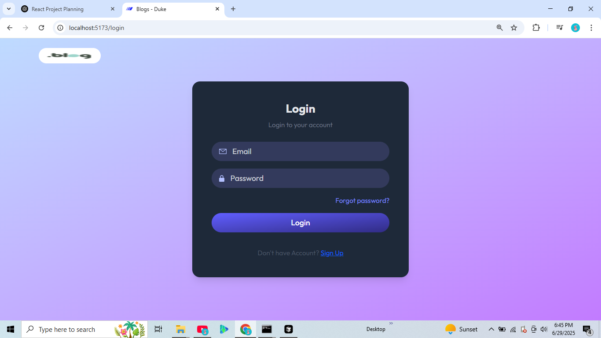
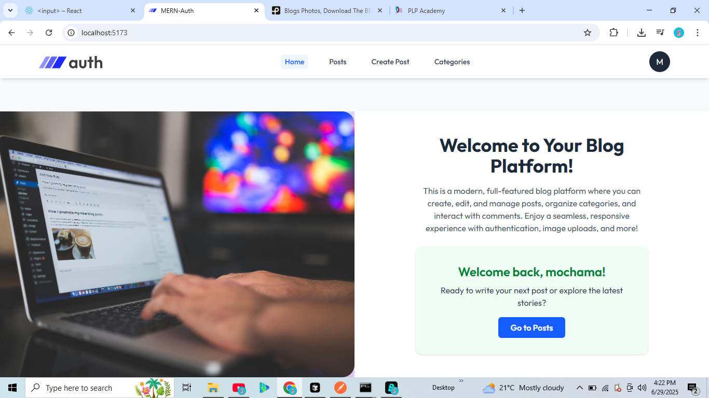
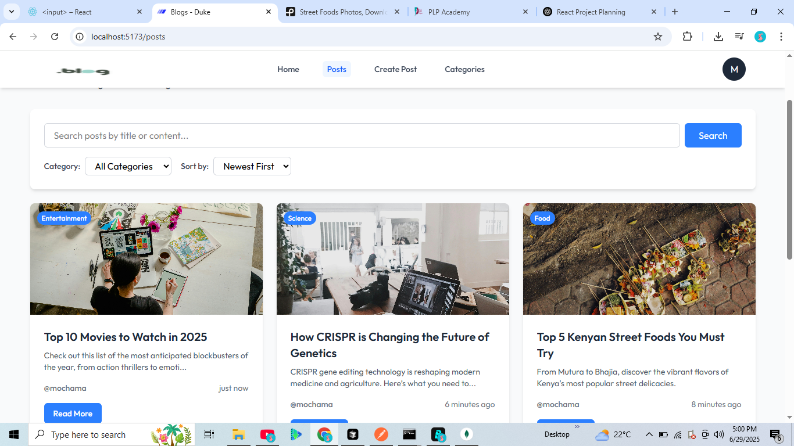
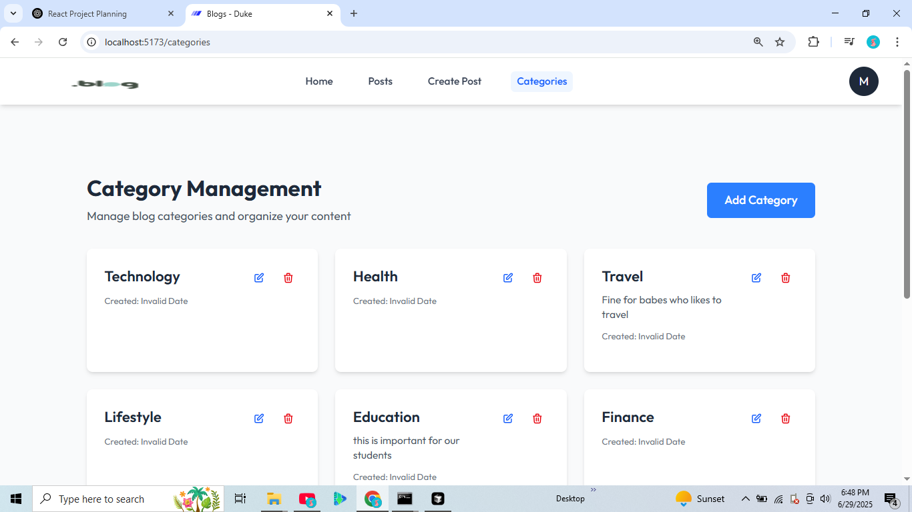

# Blog Platform Authentication & Content Management

## 🚀 Project Overview

A modern, full-featured blog platform built with React, Node.js, and MongoDB. Features include user authentication, post creation and management, category organization, image uploads, comments, search, filtering, and responsive design. Ideal for learning or launching your own content-driven site!

---

## ⚡️ Features Implemented

- **User Authentication** (register, login, JWT, email verification)
- **Create/Edit/Delete Posts** with image uploads
- **Category Management** (CRUD)
- **Comment System** (nested, edit/delete, pagination)
- **Search & Filter** (by keyword, category, sort)
- **Pagination** (6 posts per page)
- **Responsive UI** (mobile-friendly, modern design)
- **Protected Routes** (role-based access)
- **Beautiful Home Page** with split layout and login/signup

---

## 🛠️ Setup Instructions

1. **Clone the repository:**
   ```bash
   git clone <https://github.com/PLP-MERN-Stack-Development/week-4-mern-integration-assignment-DukeMochama2022.git>
   cd week-4-mern-integration-assignment-DukeMochama2022
   ```
2. **Install dependencies:**
   ```bash
   # Backend
   cd backend
   npm install
   # Frontend
   cd ../frontend
   npm install
   ```
3. **Configure environment variables:**
   - Copy `.env.example` to `.env` in both `backend` and `frontend` and fill in your values (MongoDB URI, JWT secret, etc).
4. **Start the development servers:**
   ```bash
   # In one terminal (backend)
   cd backend
   npm run dev
   # In another terminal (frontend)
   cd frontend
   npm run dev
   ```
5. **Visit** [http://localhost:5173](http://localhost:5173) in your browser.

---

## 📚 API Documentation (Main Endpoints)

### **Auth**

- `POST /api/auth/register` — Register new user
- `POST /api/auth/login` — Login
- `POST /api/auth/logout` — Logout
- `POST /api/auth/send-verify-otp` — Send email verification OTP
- `POST /api/auth/verify-account` — Verify email

### **Posts**

- `GET /api/posts` — List posts (pagination, search, filter)
- `POST /api/posts/create` — Create post _(auth required)_
- `GET /api/posts/:id` — Get post details
- `PUT /api/posts/update/:id` — Update post _(auth required, owner only)_
- `DELETE /api/posts/delete/:id` — Delete post _(auth required, owner only)_

### **Categories**

- `GET /api/categories` — List categories
- `POST /api/categories/create` — Create category _(auth required)_
- `PUT /api/categories/update/:id` — Update category _(auth required)_
- `DELETE /api/categories/delete/:id` — Delete category _(auth required)_

### **Comments**

- `GET /api/comments/post/:postId` — List comments for a post (pagination)
- `POST /api/comments/create` — Add comment _(auth required)_
- `PUT /api/comments/:commentId` — Edit comment _(auth required, owner only)_
- `DELETE /api/comments/:commentId` — Delete comment _(auth required, owner only)_

---

## 🖼️ Screenshots

### Authentication



### Home Page



### Blog List




### Category List



---

## 🤝 Contributing

Pull requests are welcome! For major changes, please open an issue first to discuss what you would like to change.

---

## 📄 License

[MIT](LICENSE)
